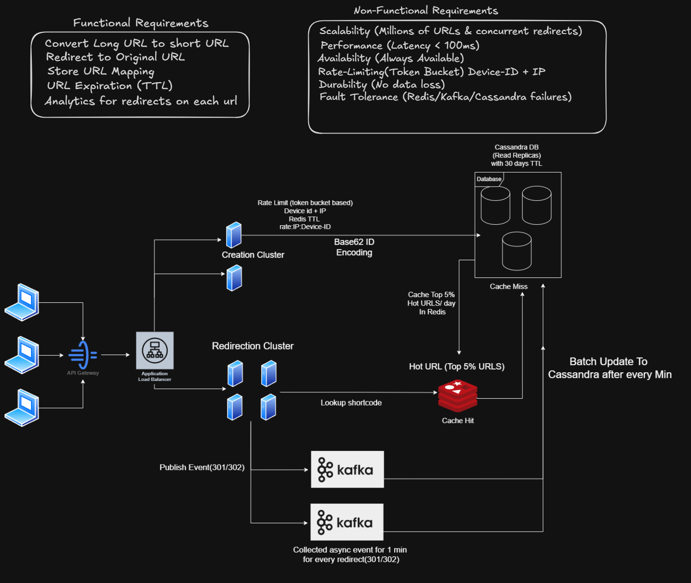

# URL Shortener - High Level System Design (HLD)

A production-inspired High-Level System Design (HLD) of a scalable URL Shortener service similar to **Bit.ly** and **TinyURL**. This repository demonstrates the architecture, design decisions, and distributed system concepts required to build a highly available, low-latency, and fault-tolerant URL shortening platform.

---

# Architecture Diagram

> Click the image below to view it in full size.

[](url-shortener-hld.png)

---

# Problem Statement

Design a URL shortening service capable of handling millions of URL creation and redirection requests while maintaining high availability, low latency, and scalability.

---

# Functional Requirements

- Convert Long URL to Short URL
- Redirect users to the original URL
- Store URL mappings
- Support URL Expiration (TTL)
- Collect analytics for every redirect

---

# Non-Functional Requirements

- Scalability
- High Availability
- Low Latency (<100ms)
- Durability (No Data Loss)
- Fault Tolerance
- Rate Limiting
- Horizontal Scaling

---

# High-Level Architecture

The system consists of the following major components:

## API Gateway

- Entry point for all incoming requests.
- Handles authentication, routing, and request forwarding.

---

## Application Load Balancer

- Distributes requests across multiple application servers.
- Prevents server overload.
- Improves availability.

---

## URL Creation Cluster

Responsible for:

- Creating short URLs
- Base62 ID Encoding
- Storing URL mappings
- Applying Rate Limiting
- Persisting data into Cassandra

---

## URL Redirection Cluster

Responsible for:

- Looking up short URLs
- Returning HTTP 301/302 redirects
- Publishing analytics events
- Reading from Redis and Cassandra

---

## Base62 Encoding

Generates compact and unique short codes using:

- 0-9
- A-Z
- a-z

This produces short, URL-friendly identifiers.

---

## Redis Cache

Stores frequently accessed (Hot) URLs.

Benefits:

- Cache Hit response in milliseconds
- Reduced database load
- Faster redirection

Only the top frequently accessed URLs are cached.

---

## Cassandra Database

Primary persistent storage for:

- URL Mapping
- Expiration Time (TTL)
- Analytics Metadata

Features:

- High write throughput
- Horizontal scalability
- Read Replicas
- High availability

---

## Kafka

Used for asynchronous event processing.

Each redirect publishes an event containing:

- Short URL
- Timestamp
- Response Code (301/302)
- Analytics Information

Kafka consumers aggregate events before updating Cassandra.

---

## Batch Processing

Instead of updating analytics on every redirect,

events are collected for one minute and written in batches.

Benefits:

- Reduced write operations
- Higher throughput
- Better database performance

---

# Request Flow

## URL Creation

```text
Client
   │
   ▼
API Gateway
   │
   ▼
Load Balancer
   │
   ▼
Creation Cluster
   │
   ▼
Generate Base62 ID
   │
   ▼
Store in Cassandra
   │
   ▼
Return Short URL
```

---

## URL Redirection

```text
Client
   │
   ▼
API Gateway
   │
   ▼
Load Balancer
   │
   ▼
Redirection Cluster
   │
   ▼
Redis Cache
   │
   ├──────────────► Cache Hit
   │                    │
   │                    ▼
   │              Return Original URL
   │
   ▼
Cache Miss
   │
   ▼
Cassandra
   │
   ▼
Update Redis
   │
   ▼
Return Original URL
   │
   ▼
Publish Analytics Event
   │
   ▼
Kafka
   │
   ▼
Batch Update Cassandra
```

---

# Technologies & Concepts

- API Gateway
- Load Balancer
- Base62 Encoding
- Redis
- Apache Kafka
- Cassandra
- Cache Hit / Cache Miss
- Rate Limiting (Token Bucket)
- URL Expiration (TTL)
- Read Replicas
- Horizontal Scaling
- Event-Driven Architecture
- Batch Processing
- High Availability
- Fault Tolerance
- Distributed Systems

---

# Key Design Decisions

- Separate Creation and Redirection clusters.
- Cache hot URLs using Redis.
- Use Cassandra for distributed storage.
- Publish analytics asynchronously through Kafka.
- Batch analytics updates to reduce database writes.
- Apply Token Bucket Rate Limiting.
- Use Base62 encoding for compact short URLs.

---

# Scalability Features

- Stateless application servers
- Horizontal scaling
- Distributed caching
- Read replicas
- Asynchronous processing
- Event streaming
- Batch database updates

---

# Future Improvements

- Custom aliases
- QR Code generation
- User authentication
- URL preview
- Malware detection
- Geographic analytics
- Click heatmaps
- Multi-region deployment
- CDN integration
- Admin Dashboard

---

# Learning Outcomes

This project demonstrates the design of a production-inspired distributed URL Shortener by applying modern System Design principles such as caching, asynchronous processing, distributed databases, event streaming, rate limiting, scalability, and fault tolerance.

---

## Repository Structure

```text
.
├── README.md
├── url-shortener-hld.png
└── Experiment-1
```

---

## Author

**Sonia Kaura**

Computer Science Engineering | System Design | Full-Stack Development | AI
